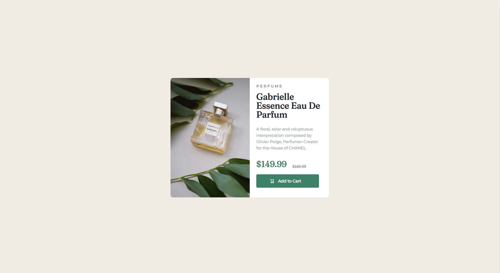

# Frontend Mentor - Product preview card component solution

This is a solution to the [Product preview card component challenge on Frontend Mentor](https://www.frontendmentor.io/challenges/product-preview-card-component-GO7UmttRfa). Frontend Mentor challenges help you improve your coding skills by building realistic projects.

## Table of contents

- [Overview](#overview)
- [The challenge](#the-challenge)
- [Screenshot](#screenshot)
- [Links](#links)
- [My process](#my-process)
- [Built with](#built-with)
- [What I learned](#what-i-learned)
- [Author](#author)

## Overview

This is my solution to the Frontend Mentor Challenge.

### The challenge

Users should be able to:

- View the optimal layout depending on their device's screen size
- See hover and focus states for interactive elements

### Screenshot

### Links

- Solution URL: [Repo Link](https://github.com/David4bay/Frontend-Mentor-Preview-Card-Solution)
- Live Site URL: [Netlify Link](https://dreamy-llama-fcda3a.netlify.app)

## My process

I started with the HTML Markup and then used SASS(scss) for the styling, flexbox was used for positioning.

### Built with

- Semantic HTML5 markup
- CSS custom properties
- Flexbox

### What I learned

I learnt a lot about specificity when I realized it could interfere with media queries for different resolutions.

## Author

- Website - [My Medium](https://davidbayode.medium.com)
- Frontend Mentor - [@David4bay](https://www.frontendmentor.io/profile/David4bay)
- Twitter - [@Davidbay01](https://www.twitter.com/davidbay01)
